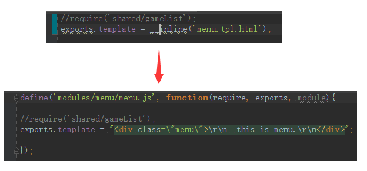

## 量身打造angular开发解决方案(4) - 模块化框架

> 前端模块化框架肩负着 模块管理、资源加载 两项重要的功能，这两项功能与工具、性能、业务、部署等工程环节都有着非常紧密的联系。因此，模块化框架的设计应该最高优先级考虑工程需要。

### 1. Why Not RequireJS/SeaJS/Browserify

原因很简单：
> 以纯前端方式实现模块化框架 **不能** 同时满足 `按需加载`，`请求合并` 和 `依赖管理` 三个需求。
>
> 导致这个问题的根本原因是： `纯前端方式只能在运行时分析依赖关系。`
>
> 详细论述参见： [「前端工程与模块化框架」](https://github.com/fouber/blog/issues/4)


先谈谈`Browserify`，其实我一直不喜欢这东西，所有文件都打包在一起，太臃肿了，直接排除掉。它宣称的`前后端代码复用`也是个伪需求，实际工程中没有多少需要前后端复用的东西。无法理解它的存在意义。

而使用`RequireJS/SeaJS`之类的纯前端框架，是需要在运行时才去分析模块依赖。不可避免的会产生`串行依赖加载问题`，即使它提供的`combo`批量加载功能，也只是局部缓解。

要兼顾`性能`的同时解决模块化`依赖管理`和`按需加载`问题，其关键点在于：
> 在**构建期**就提前分析资源依赖，而不能到**运行时**才去分析模块间的依赖关系。


### 2. 设计自己的模块化框架
其实没那么难，经过`CommonJS` / `AMD` / `CMD`这么多年的发展，模块化框架的思想和规范都已经有很好的总结和范式了。
只需要以下三个接口即可（发现没？跟其他规范几乎一样）：

接口 | 定义 | 描述
------------ | ------------- | -------------
模块定义 | `define(id, function factory(require, exports, module){});` | 模块定义
异步加载 | `require.async(ids, callback);` | 异步加载多个模块，支持combo
框架配置 | `require.config(options);` | 资源依赖表和其他配置

这里容我偷个懒，直接引入 [scrat.js](https://github.com/scrat-team/scrat.js) 即可满足我们的需求。

**关键特性：**
- 无需运行时分析依赖，通过和构建工具的配合，直接输入资源依赖表。
- 支持把资源缓存到`localstorage`，第二次访问时则无需加载。
- 支持`combo`批量加载。
- 支持通过URL参数临时屏蔽`combo`和`cache`，便于调试。

需要注意的是，它使用`hash`来标识当前版本，当版本升级时会直接清空全部缓存文件，因为：

> 性能优化既是一个工程问题，又是一个统计问题。
> 只关注一个页面的首次加载是很片面的。还需考虑全站页面间跳转、项目迭代后更新资源等情况下的优化策略。
>
> -- 摘自[前端工程与性能优化](https://github.com/fouber/blog/blob/master/201405/01.md)

PS: 若你还是希望使用`seajs`则可以参考下 [spmx](https://github.com/fouber/spmx) 以及它对应的 [fis-postpackager-seajs](https://github.com/fouber/fis-postpackager-seajs) 。

### 3. 构建期分析资源依赖表
在`FIS`配置的`modules.postpackager`里面配置一个处理器即可，参见`frameworkConf.js`

资源依赖表主要包含`依赖(deps)`和`别名(alias)`。

**主要思路：**
- 获取`FIS`生成的`map资源映射表`。
- 通过`component.json`递归分析生态模块的依赖，并为它们建立别名。
- 获取所有内部模块的主文件，收集它的依赖，并为它建立别名。
- 把收集到的`资源依赖表`输出，并替换掉标识为`isView`的页面文件的`__FRAMEWORK_CONFIG__`。

需注意的地方：
- 由于`FIS`架构问题，不支持在`单文件编译期`增加额外文件。
- 所以当我们为了缓存等需求，需要把css和tpl转换时，只能在这里进行一定的hack。

示例如下：
```
require.config({
  "cache": true,
  "urlPattern": "/%s",
  "comboPattern": "/co??%s",
  "version": "0.0.1",
  "name": "ngfis-showcase",
  "combo": true,
  "hash": "803d336",
  "alias": {
    "app": "app/app.js",
    "modules/menu": "modules/menu/menu.js",
    "shared/utils": "shared/utils/utils.js"
  },
  "deps": {
    "modules/menu/menu.js": [
      "modules/menu/menu.css"
    ]
  }
});
require.async(['app'], function(app){

});

```

### 4. 自动包裹代码
##### 4.1 define
如需求调研中提到的「像`NodeJS`一样编码」，所以我们可以通过工具来自动包裹代码。

在`FIS`配置的`modules.postprocessor.js`里面配置一个处理器即可，参见`define.js`。

摘抄部分代码如下，实际项目中一般还需要分析`component.json`等文件生成`exports`等信息。

```
module.exports = function(content, file){
  if(file.isMod){
    //包裹define
    content = "define('" + file.getId() + "', function(require, exports, module){\n\n" + content + "\n\n});";
  }
  return content;
};
```

编译体验下：<br>


##### 4.2 annotate
「自动生成依赖注入声明」功能，也是顺便在这里实现的， 把`ng-annotate`包装成FIS插件即可。
参见`annotate.js`。

关键代码如下：
```
var ngAnnotate = require('ng-annotate');
module.exports = function(content, file){
  if(file.isJsLike) {
    var result = ngAnnotate(content, {add: true, single_quotes: true});
    if(!result.errors){
      content = result.src;
    }else{
      result.errors.forEach(function (error) {
        fis.log.error(error);
      });
    }
  }
  return content;
};
```


### 5. 按需加载

`Angular`目前是不支持按需加载的，所以我们只能通过一定的方法进行hack。

**按需加载有几种实现方式：**
- 根据URL参数，加载对应的依赖，然后手动boostrap，不支持单页面。
- 只实现`controller/service/directive`的按需加载， 支持`ngRoute`和`ui-router`。
- 实现完整的按需加载， 支持`module`的按需加载，具体参见[ocLazyLoad](https://github.com/ocombe/ocLazyLoad) 。(本文不涉及到该方法)


**主要思路：**
  - 在`config`期保存`$provider`的相关引用。
  - 利用`ngRoute/ui-router`的`resolve`属性，通过模块化框架加载文件。
  - 加载回来的`controller`和它对应的依赖通过上面保存的引用去动态注册。
  - `Angular`执行对应的`Controller`，并呈现给用户。

具体参见`angular-lazyload`的相关代码。
