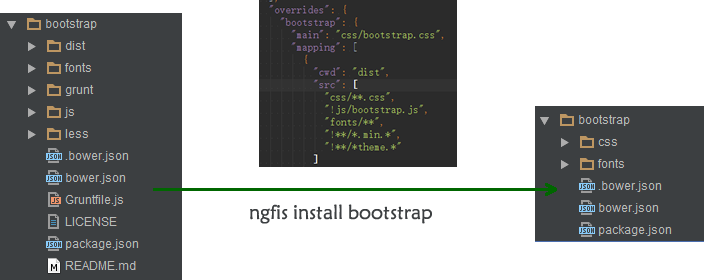

## 量身打造angular开发解决方案(5) - 生态模块

> 模块生态及版本管理是一个细思恐极的问题。

### 1. 为何不直接用`bower`？
当前社区的模块质量良莠不齐，很多类库都不符合[`bower.json-spec`](https://github.com/bower/bower.json-spec),的规范，仓库里面经常有很多源码垃圾文件，甚至很多模块安装之后不可用或者根本安装不上。

@fouber 也曾多次提到「模块生态及版本管理是一个细思恐极的问题」， 所以[`scrat`](http://scrat-team.github.io/#!/components)选择的方案是**「自建高质量的小范围生态」**。
对于社区的生态模块， 采用`travis`同步方式， 参见[transform.js]( https://github.com/scrat-team/font-awesome/blob/master/.scrat/transform.js)。

不过作为`angular`的拥护者， 丢弃`bower`总是觉得可惜， 同时发现`angular`的周边模块质量相对好一点。

于是经过多次的反复纠结，于是编写了该组件，可以较完美的满足我的需求。

### 2. 解决思路
- 简单的说，`scrat`是把模块转换的过程放到`travis`，而本方案是放到`install`过程。
- 调用[`bower programmatic api`](http://bower.io/docs/api/#programmatic-api)安装依赖

```javascript
//读取项目的组件配置文件(bower.json)
var projectMeta = getProjectMeta(root, directory);

//合并内置规则
projectMeta.overrides = _.defaults(projectMeta.overrides || {}, require('./bower-meta'));

//调用bower安装生态模块到component_modules
var installer = bower.commands.install(repo, {save: true}, {directory: 'component_modules'});

//安装完成后，清洗文件
installer.on("end", function (installed) {
  for(var key in installed) {
    var meta = _.assign(item.pkgMeta, projectMeta.overrides && projectMeta.overrides[componentName]);
    syncFiles(key, meta, componentRoot, ignore);
  }
});
```

- 根据`mapping`配置，使用[glob规则](https://github.com/isaacs/node-glob)来清洗目录文件

```javascript
//清洗文件(仅展示核心代码)
function syncFiles(componentName, meta, componentRoot, ignore){
  //...
  var srcDir = path.join(componentRoot, componentName);
  var targetDir = path.join(componentRoot, '.' + meta.name);

  //遍历所有mapping规则
  meta.mapping.forEach(function (pattern) {
    //匹配glob规则, 获取文件列表
    var files = globby.sync(pattern.src, {cwd: path.join(srcDir, pattern.cwd)});
    //复制文件到临时目录
    files.forEach(function (file) {
      var sourceFile = path.join(pattern.cwd, file).replace(/\\/g,'/');
      var targetFile = file.replace(/\\/g,'/');
      if (fs.statSync(path.join(srcDir, sourceFile)).isFile()) {
        console.log('    copy %s -> %s', sourceFile, targetFile);
        fs.copySync(path.join(srcDir, sourceFile), path.join(targetDir, targetFile));
      }
    });
  });

  //...
  //重写生态模块的元数据(bower.json)

  //替换临时目录为源码目录
  fs.removeSync(srcDir);
  fs.renameSync(targetDir, srcDir);
}
```

### 3. 封装方案

然后，我们把它独立为一个单独的插件， 复用出去： https://github.com/ng-workflow/ngfis-command-install

在`ngfis`里面，`npm install ngfis-command-install`，再执行`ngfis install`则自动会找到该插件。

相关介绍参见： [「FIS插件扩展点列表」](http://fis.baidu.com/docs/more/extension-point.html)

### 4. 示例
```json
{
  "name": "ngfis-showcase",
  "private": true,
  "dependencies": {
    "angular": "~1.3.7",
    "bootstrap": "~3.3.1",
    "zepto": "~1.1.6"
  },
  "devDependencies": {
    "angular-mocks": "~1.3.7"
  },
  "ignoreDependencies": [
    "jquery"
  ],
  "overrides": {
    "bootstrap": {
      "main": "css/bootstrap.css",
      "mapping": [{
        "cwd": "dist",
        "src": [
          "css/**.css",
          "!js/bootstrap.js",
          "fonts/**",
          "!**/*.min.*",
          "!**/*theme.*"
        ]
      }]
    }
  }
}

````

**运行效果：**

